# TourOperatorController Class Diagram

## 1.2.1 Overall Class Diagram

```mermaid
classDiagram
    %% Controller Layer
    class TourOperatorController
    class ControllerBase

    %% Service Layer
    class ITourOperatorService
    class TourOperatorService
    class IAuthService
    class AuthService

    %% Request DTOs
    class TourOperatorSearchRequest
    class CreateTourOperatorRequest
    class UpdateTourOperatorRequest
    class CreateTourGuideRequest
    class RegisterRequest

    %% Response DTOs
    class TourOperatorListResponse
    class TourOperatorDetailResponse
    class TourOperatorResponse
    class TourOperatorMediaResponse

    %% Entity Models
    class TourOperator
    class User
    class TourOperatorMedia
    class TourGuide
    class Tour

    %% Database Context
    class MyDBContext

    %% Relationships - Inheritance
    TourOperatorController --> ControllerBase : extends

    %% Relationships - Dependency (uses)
    TourOperatorController ..> ITourOperatorService : uses
    TourOperatorController ..> IAuthService : uses
    TourOperatorController ..> MyDBContext : uses
    TourOperatorController ..> TourOperatorSearchRequest : accepts
    TourOperatorController ..> CreateTourOperatorRequest : accepts
    TourOperatorController ..> UpdateTourOperatorRequest : accepts
    TourOperatorController ..> CreateTourGuideRequest : accepts
    TourOperatorController ..> RegisterRequest : creates

    %% Service Implementation
    TourOperatorService --> ITourOperatorService : implements
    AuthService --> IAuthService : implements

    %% Service Dependencies
    TourOperatorService ..> TourOperatorListResponse : returns
    TourOperatorService ..> TourOperatorDetailResponse : returns
    TourOperatorService ..> TourOperator : manages
    AuthService ..> RegisterRequest : processes

    %% DTO Relationships
    TourOperatorListResponse --> TourOperatorResponse : contains
    TourOperatorDetailResponse --> TourOperatorMediaResponse : contains

    %% Entity Relationships
    TourOperator --> User : belongs to
    TourOperator --> TourOperatorMedia : has many
    TourOperator --> TourGuide : manages many
    TourOperator --> Tour : owns many
    User --> TourOperator : has one

    %% Database Context
    MyDBContext --> TourOperator : manages
    MyDBContext --> User : manages
    MyDBContext --> TourOperatorMedia : manages
    MyDBContext --> TourGuide : manages
    MyDBContext --> Tour : manages
```



## 1.2.2 Package Structure

```
TourManagement_BE/
├── Controllers/
│   └── TourOperatorController.cs
├── Service/
│   ├── ITourOperatorService.cs
│   ├── TourOperatorService.cs
│   ├── IAuthService.cs
│   └── AuthService.cs
├── Data/
│   ├── DTO/
│   │   ├── Request/
│   │   │   ├── TourOperatorSearchRequest.cs
│   │   │   ├── CreateTourOperatorRequest.cs
│   │   │   ├── UpdateTourOperatorRequest.cs
│   │   │   ├── CreateTourGuideRequest.cs
│   │   │   └── RegisterRequest.cs
│   │   └── Response/
│   │       ├── TourOperatorListResponse.cs
│   │       ├── TourOperatorDetailResponse.cs
│   │       ├── TourOperatorResponse.cs
│   │       └── TourOperatorMediaResponse.cs
│   ├── Models/
│   │   ├── TourOperator.cs
│   │   ├── User.cs
│   │   └── TourOperatorMedia.cs
│   └── Context/
│       └── MyDBContext.cs
└── Repository/
    ├── Interface/
    └── Imple/
```

## 1.2.3 Relationship Types Explanation

### 1.2.3.1 Inheritance (Generalization)
- **Symbol**: Solid line with hollow triangle arrowhead
- **Direction**: From subclass to superclass
- **Example**: `TourOperatorController` → `ControllerBase`

### 1.2.3.2 Implementation
- **Symbol**: Solid line with hollow triangle arrowhead
- **Direction**: From implementation to interface
- **Example**: `TourOperatorService` → `ITourOperatorService`

### 1.2.3.3 Dependency (Usage)
- **Symbol**: Dashed line with open arrowhead
- **Direction**: From dependent class to class it depends on
- **Examples**: 
  - `TourOperatorController` ..> `ITourOperatorService` (uses service)
  - `TourOperatorController` ..> `TourOperatorSearchRequest` (accepts request)

### 1.2.3.4 Association (Contains/Has)
- **Symbol**: Solid line with open arrowhead
- **Direction**: From container to contained
- **Examples**:
  - `TourOperatorListResponse` → `TourOperatorResponse` (contains)
  - `TourOperator` → `TourOperatorMedia` (has many)

### 1.2.3.5 Database Management
- **Symbol**: Solid line with open arrowhead
- **Direction**: From context to entity
- **Example**: `MyDBContext` → `TourOperator` (manages)

## 1.2.4 Class Naming Conventions

### 1.2.4.1 Controller Naming
- **Pattern**: `{Entity}Controller`
- **Example**: `TourOperatorController`

### 1.2.4.2 Service Naming
- **Interface Pattern**: `I{Entity}Service`
- **Implementation Pattern**: `{Entity}Service`
- **Example**: `ITourOperatorService`, `TourOperatorService`

### 1.2.4.3 DTO Naming
- **Request Pattern**: `{Action}{Entity}Request`
- **Response Pattern**: `{Entity}{Type}Response`
- **Examples**: 
  - `CreateTourOperatorRequest`
  - `TourOperatorListResponse`

### 1.2.4.4 Model Naming
- **Pattern**: `{Entity}`
- **Example**: `TourOperator`, `User`

## 1.2.5 Key Relationships Summary

| **Relationship Type** | **From** | **To** | **Description** |
|----------------------|----------|--------|-----------------|
| Inheritance | `TourOperatorController` | `ControllerBase` | Controller extends base class |
| Implementation | `TourOperatorService` | `ITourOperatorService` | Service implements interface |
| Dependency | `TourOperatorController` | `ITourOperatorService` | Controller uses service |
| Dependency | `TourOperatorController` | `TourOperatorSearchRequest` | Controller accepts request |
| Association | `TourOperator` | `User` | TourOperator belongs to User |
| Association | `TourOperator` | `TourOperatorMedia` | TourOperator has many Media |
| Management | `MyDBContext` | `TourOperator` | Context manages entity | 